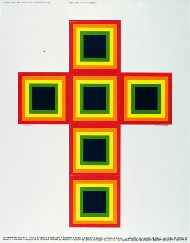

# Web Animation
 
 Ik gebruik voor deze opdracht het volgende [artwork](https://designarchives.aiga.org/#/entries/%2Bcollections%3A%22B.%20Martin%20Pedersen%22/_/detail/relevance/asc/6/7/21993/calendar-promotion-to-designers-december-1968/1).
 
 
 
 Het artwork is gemaakt door B. Martin Pedersen in 1968. Hij werkt al 40 jaar in grafisch ontwerp, reclame, illustratie en fotografie en heeft in deze tijd voor zijn werk meer dan 300 prijzen gekregen. Over het artwork kon ik niet veel vinden naast een korte beschrijving van bovenstaande bron waar in staat dat het een kruis is waar je een geschenkverpakking van kan maken. 
 
# Proces

## Eerste idee

# Tweede idee

# Interactie: clicks

# Interactie: keydown

# Sources
* [Informatie B. Martin Pendersen](https://www.aiga.org/medalist-martinpedersen)