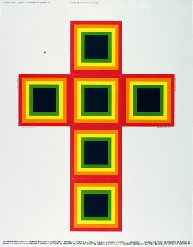
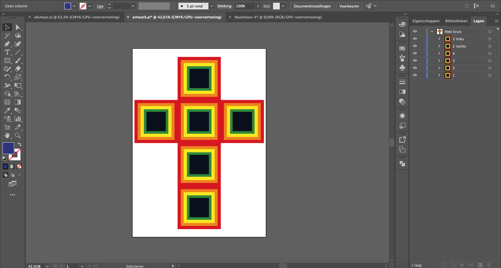
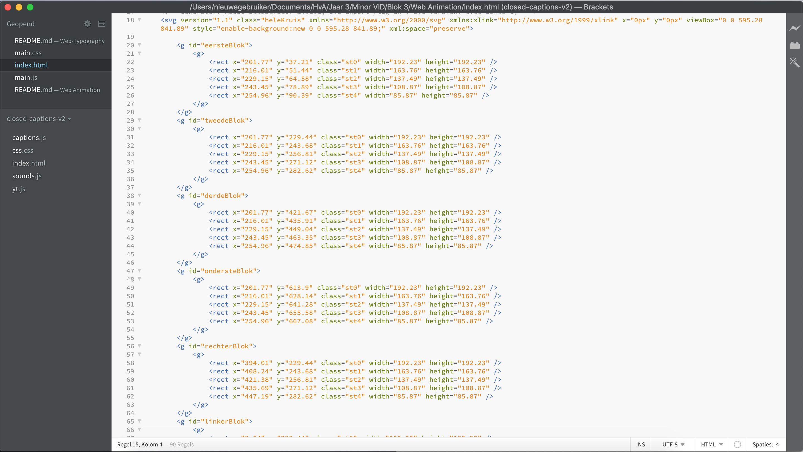

# Web Animation by Jorien Korn VID1
 
 Ik gebruik voor deze opdracht het volgende [artwork](https://designarchives.aiga.org/#/entries/%2Bcollections%3A%22B.%20Martin%20Pedersen%22/_/detail/relevance/asc/6/7/21993/calendar-promotion-to-designers-december-1968/1):
 
 
 
 Het artwork is gemaakt door B. Martin Pedersen in 1968. Hij werkt al 40 jaar in grafisch ontwerp, reclame, illustratie en fotografie en heeft in deze tijd voor zijn werk meer dan 300 prijzen gekregen. Over het artwork kon ik niet veel vinden naast een korte beschrijving van bovenstaande bron waar in staat dat het een kruis is waar je een geschenkverpakking van kan maken. 
 
# Proces vooraf

## Idee
Ik heb ervoor gekozen om niet iets te doen met het feit dat het als geschenkverpakking is bedoeld. Ik heb er wel over nagedacht dat ik bijvoorbeeld iets kon doen met dat het perspectief verandert en dat de verpakking zichzelf in elkaar zet maar ik vond het leuker om met mijn eerste indruk verder te gaan. Ik had namelijk op het artwork geklikt omdat ik dacht dat het iets met geloof te maken zou hebben. Ik kreeg direct inspiratie om naast de originele versie er een 'evil' en 'heilige' versie van te maken en daarvoor animaties te verzinnen. 

## Stijl
Omdat ik met mijn achtergrondverhaal en intentie van het artwork al afwijk van het origineel wil ik wel waar blijven aan het originele artwork door de stijl te behouden. Hiermee kies ik er dus voor om alleen vlakke kleuren te gebruiken, geen textuur, gradients, schaduwen, etc. Eigenlijk heel minimalistisch wat dat betreft, daarom ga ik vooral met verschillende kleuren/thema's spelen.

# Aan de slag

## SVG maken


Het artwork namaken in Illustrator was vrij makkelijk, het artwork bestaat namelijk alleen maar uit vierkanten. Ik heb ze gegroepeerd per blok en als geheel zodat ik dit in mijn HTML kan gebruiken om specifieke onderdelen aan te roepen. Ik het artwork geëxporteerd als SVG-code en dit in mijn HTML bestand geplakt.

## Interactie
* Load/refresh de pagina (inladen elementen)
* Click (holy state)
* Click (evil state)
* Keyboard (invert)

### Load/refresh de pagina (inladen elementen)
Omdat ik in Illustrator de blokken had gegroepeerd kon ik deze in CSS aanroepen met ```svg > g:nth-of-type()``` en ze één voor één inladen door ```animation``` en de bijbehorende eigenschappen te gebruiken. Dit heb ik op onderstaande manier gedaan:

```
svg > g:nth-of-type(3) {
    opacity: 0;
    animation: appearEen;
    animation-delay: 100ms;
    animation-duration: 100ms;
    animation-timing-function: ease-out;
    animation-fill-mode: forwards;
}

@keyframes appearTwee {
    0% {
        opacity: 0;
        transform: translateY(-45em);
    }

    100% {
        opacity: 1;
        transform: translateY(0);
    }
}
```
Zoals je ziet staat eerst de opacity op 0, doordat animation geactiveerd wordt na 100ms verandert de opacity van 0 naar 1 en schuift hij van boven (off-screen) naar beneden door middel van ```transform: translateY```. Zo lijkt het alsof de blokken van boven in de pagina vallen. Van het eerste tot het laatste blok is steeds een grotere delay zodat ze niet allemaal tegelijk ingeladen worden.

### Click (holy state)

### Click (evil state)

### Keyboard (invert)

## Responsive

## Alles wat nieuw was voor mij op een rijtje
* Met SVG animeren
* CSS filters (invert)
* transform: translateX
* cursor
* mix-blend-mode


# Sources
* [Informatie B. Martin Pendersen](https://www.aiga.org/medalist-martinpedersen)