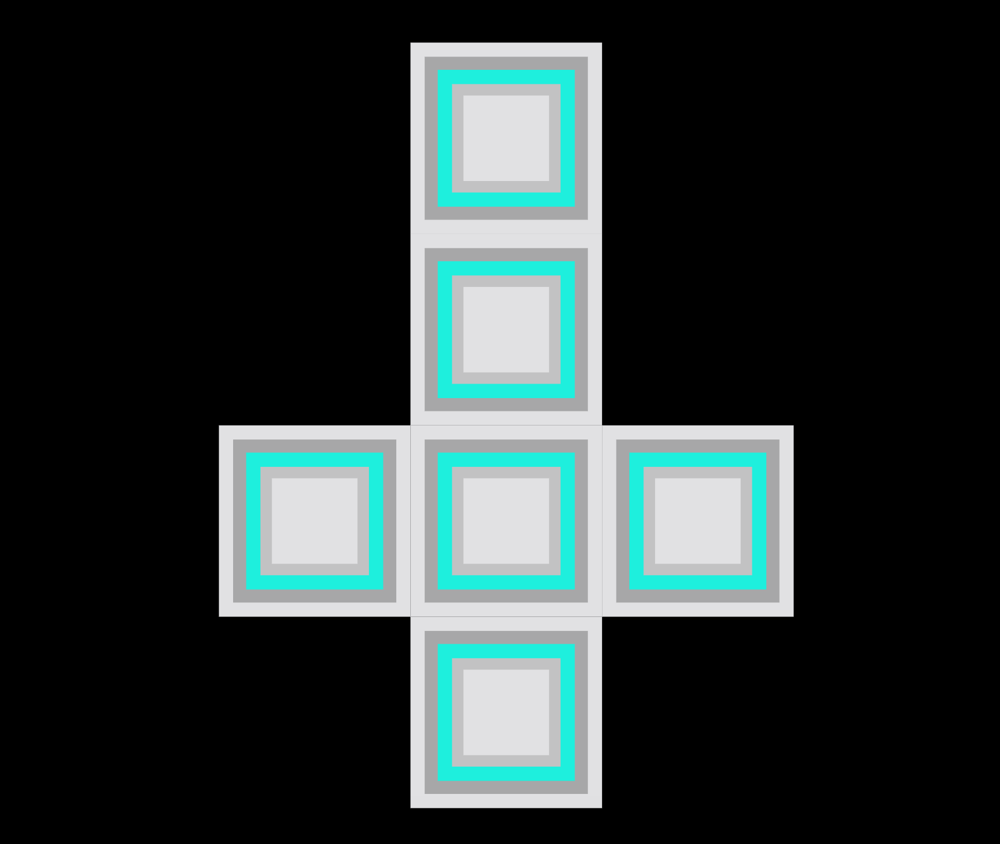

# Web Animation by Jorien Korn VID1
 
 Ik gebruik voor deze opdracht het volgende [artwork](https://designarchives.aiga.org/#/entries/%2Bcollections%3A%22B.%20Martin%20Pedersen%22/_/detail/relevance/asc/6/7/21993/calendar-promotion-to-designers-december-1968/1):
 
 
 
 Het artwork is gemaakt door B. Martin Pedersen in 1968. Hij werkt al 40 jaar in grafisch ontwerp, reclame, illustratie en fotografie en heeft in deze tijd voor zijn werk meer dan 300 prijzen gekregen. Over het artwork kon ik niet veel vinden naast een korte beschrijving van bovenstaande bron waar in staat dat het een kruis is waar je een geschenkverpakking van kan maken. 
 
# Proces vooraf

## Idee
Ik heb ervoor gekozen om niet iets te doen met het feit dat het als geschenkverpakking is bedoeld. Ik heb er wel over nagedacht dat ik bijvoorbeeld iets kon doen met dat het perspectief verandert en dat de verpakking zichzelf in elkaar zet maar ik vond het leuker om met mijn eerste indruk verder te gaan. Ik had namelijk op het artwork geklikt omdat ik dacht dat het iets met geloof te maken zou hebben. Ik kreeg direct inspiratie om naast de originele versie er een 'evil' en 'heilige' versie van te maken en daarvoor animaties te verzinnen. 

## Stijl
Omdat ik met mijn achtergrondverhaal en intentie van het artwork al afwijk van het origineel wil ik wel waar blijven aan het originele artwork door de stijl te behouden. Hiermee kies ik er dus voor om alleen vlakke kleuren te gebruiken, geen textuur, gradients, schaduwen, etc. Eigenlijk heel minimalistisch wat dat betreft, daarom ga ik vooral met verschillende kleuren/thema's spelen.

# Aan de slag

## SVG maken


Het artwork namaken in Illustrator was vrij makkelijk, het artwork bestaat namelijk alleen maar uit vierkanten. Ik heb ze gegroepeerd per blok en als geheel zodat ik dit in mijn HTML kan gebruiken om specifieke onderdelen aan te roepen. Ik het artwork geëxporteerd als SVG-code en dit in mijn HTML bestand geplakt.

## Interactie
* Load/refresh de pagina (inladen elementen)
* Click (holy state)
* Click (evil state)
* Keyboard (invert)
* Keyboard (mix-blend-mode)

### Load/refresh de pagina (inladen elementen)

Omdat ik in Illustrator de blokken had gegroepeerd kon ik deze in CSS aanroepen met ```svg > g:nth-of-type()``` en ze één voor één inladen door ```animation``` en de bijbehorende eigenschappen te gebruiken. Dit heb ik op onderstaande manier gedaan:

```
svg > g:nth-of-type(3) {
    opacity: 0;
    animation: appearEen;
    animation-delay: 100ms;
    animation-duration: 100ms;
    animation-timing-function: ease-out;
    animation-fill-mode: forwards;
}

@keyframes appearTwee {
    0% {
        opacity: 0;
        transform: translateY(-45em);
    }

    100% {
        opacity: 1;
        transform: translateY(0);
    }
}
```

Zoals je ziet staat eerst de opacity op 0, doordat de ```animation``` geactiveerd wordt na 100ms verandert de opacity van 0 naar 1 en schuift hij van boven (off-screen) naar beneden door middel van ```transform: translateY```. Zo lijkt het alsof de blokken van boven in de pagina vallen. Van het eerste tot het laatste blok is er steeds een grotere delay zodat ze niet allemaal tegelijk ingeladen worden maar na elkaar vallen.

### Click (holy state)

 
Om deze state te activeren heb ik een knop, door middel van semantisch gebruik aan ```<button></button>```, aangemaakt met een pijl die omhoog wijst. Zodra je hierop klikt wordt de volgende JavaScript code gelanceert:

```
function klikRechts() {
    console.log('rechter knop');
    for (i = 0; i < rect.length; i++) {
        if (rect[i].classList.contains('st0')) {
            rect[i].classList.toggle('st0holy');
        } else if (rect[i].classList.contains('st1')) {
            rect[i].classList.toggle('st1holy');
        } else if (rect[i].classList.contains('st2')) {
            rect[i].classList.toggle('st2holy');
        } else if (rect[i].classList.contains('st3')) {
            rect[i].classList.toggle('st3holy');
        } else if (rect[i].classList.contains('st4')) {
            rect[i].classList.toggle('st4holy');
        }
    }
    
    heleKruis.classList.toggle('heleKruisHoly');
    body.classList.toggle('heleBodyHoly');
}
```

In deze function wordt een for loop geactiveerd, deze gaat de hele array aan rectangles die in de HTML staan na. De loop kijkt of de rectangles de class 'st0', 'st1', 'st2', 'st3' of 'st4' bevat en zo ja, vervangt hij deze met de bijbehorende nieuwe class. In CSS staat voor elke class een andere fill aangegeven die past bij het thema en deze wordt vervangen met een ```transition-timing-function: ease``` zodat het smooth verloopt van de ene naar de andere kleur.

Hiernaast wordt ook de body aangeroepen om in CSS van achtergrond kleur te veranderen die past bij het thema en door heleKruisHoly aan te roepen activeert het een class met een animation die gebruik maakt van ```@keyframes``` om de indruk te geven dat het kruis zweeft, dit heb ik simpelweg met ```margin-top``` gedaan.

### Click (evil state)

 
Voor deze state geldt voor het grootste gedeelte hetzelfde als wat hierboven staat. Het verschil zit hem hier in dat deze state niet zweeft maar zich omdraait door middel van ```transform: rotate(180deg);```. Het is een nodd naar de horrorfilms waar een omgedraaid kruis als kwaad wordt gezien, daarom past dit goed bij de evil versie. Ook dit wordt gedaan in ```@keyframes```.

### Keyboard (invert)


Om nog een kleuren thema toetevoegen ging ik kijken naar CSS filters, ik vond invert leuk en heb deze gebruikt. Als je op je toetsenbord op I klikt wordt de volgende JavaScript code gelanceert: 

```
function invertDesktop(event) {
    if (event.keyCode == 73) {
        console.log(event.keyCode);
        heleBody.classList.add('invert');
    }
    if (event.keyCode == 79) {
        console.log(event.keyCode);
        heleBody.classList.remove('invert');
    }
}
```

Hier kijkt de code naar of de keycode overeen komt met de keycode van de I of de O, als hij overeen komt met de I wordt de class 'invert' toegevoegd. Deze class zorgt ervoor dat het filter geactiveerd wordt en deze komt over de hele pagina heen. Als de keycode overeen komt met de O wordt de class 'invert' verwijdert en gaat hij dus weer terug naar het de originele kleuren.

### Keyboard (mix-blend-mode)


Naast filters had ik ook nog nooit gebruik gemaakt van ```mix-blend-mode```, hiervan vond ik ```color-burn``` het meest onderscheidend van wat ik al had en heb ik daarom voor die gekozen. Dit wordt met dezelfde code geactiveerd als die hierboven staat alleen moet je dan de letter 'B' klikken.

## Responsive

## Alles wat nieuw was voor mij op een rijtje
* Met SVG animeren
* CSS filters (invert)
* transform: translateX
* cursor
* mix-blend-mode


# Sources
* [Informatie B. Martin Pendersen](https://www.aiga.org/medalist-martinpedersen)